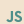
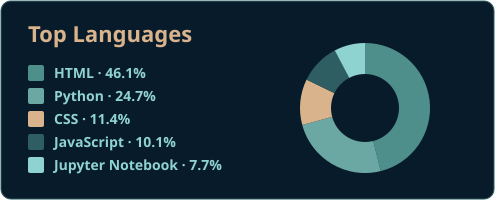

  

  <b>Estudante de Engenharia de Software | Backend, dados e aplicações web</b>

## 🖥 Tecnologias e Ferramentas

  
  
  
  
  
  
  
  
  
  
  
  
  
  
  

## 🚀 Projetos em destaque

### <a href="https://github.com/christiano-gonara/teste-abrasel-dados" style="color:#D9B38C">Análise de dados do setor de alimentação</a>
Análise de dados abertos de CNPJ, com pipeline de tratamento, notebook reproduzível e dashboard executivo.
**Python · Jupyter · DuckDB · Parquet**

### <a href="https://github.com/christiano-gonara/padrinho-track" style="color:#D9B38C">Padrinho Track</a>
Sistema web para acompanhar o programa de mentoria acadêmica, incluindo presenças, reuniões, advertências, relatórios e certificados.
**Python · Flask · SQLite/PostgreSQL · pytest**

### <a href="https://github.com/christiano-gonara/candidatosTSE" style="color:#D9B38C">Candidatos TSE</a>
Aplicação web para consultar candidaturas de Minas Gerais, com busca por nome ou número e filtros por cargo e partido.
**Java · Spring Boot · Thymeleaf · OpenCSV**

### <a href="https://github.com/christiano-gonara/web-scraper-scrapy" style="color:#D9B38C">Web Scraper com Scrapy</a>
Crawler para coleta e filtragem de dados de e-commerce, com paginação e exportação em JSON.
**Python · Scrapy**

## ⏱ Minhas métricas

  <table>
    <tr>
      <td>
        
      </td>
      <td>
        
      </td>
    </tr>
    <tr>
      <td align="center" colspan="2">
        
      </td>
    </tr>
  </table>

## 🚀 Sobre Mim
- 🎓 **Educação:** Engenharia de Software na PUC Minas.
- 👥 **Liderança:** Coordenação de mentoria acadêmica, apoiando a organização do programa e o acompanhamento de estudantes ingressantes.
- ☕ **Java:** Aplicação web com Spring Boot para consulta e filtragem de candidaturas eleitorais.
- 🐍 **Python:** Projetos com Flask, Scrapy e análise de dados.
- ⚙️ **JavaScript:** Interfaces e dashboards web integrados a APIs.
- 📐 **Interesses:** Desenvolvimento backend, dados, integração de sistemas e construção de aplicações úteis.

## 🎭 Diferenciais
- Teatro e oratória — Escola de Teatro PUC Minas.

## 📚 Leituras Técnicas

  <table>
    <tr>
      <td align="center">
        
<b>Entendendo Algoritmos</b>

        
      </td>
      <td align="center">
        
<b>O Programador Pragmático</b>

        
      </td>
      <td align="center">
        
<b>O Mítico Homem-Mês</b>

        
      </td>
    </tr>
  </table>

## ☎ Contato

  <table>
    <tr>
      <td>
        
      </td>
      <td>
        
      </td>
      <td>
        
      </td>
    </tr>
  </table>

   
  
   
  

